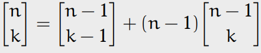
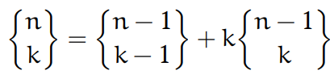
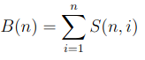

1. [Числа Стирлинга](#stirling)
    1. [Числа Стирлинга первого рода](#stirling)
    2. [*Числа Стирлинга первого рода](#stirling)
    3. [Числа Стирлинга второго рода](#stirling2)
2. [Числа Белла](#bell)

## Числа Стирлинга 

### 1. Число Стирлинга первого рода

### 2. *Тоже число Стирлинга первого рода
Числом Стирлинга первого рода [n k] называется число способов разбить n-элементное множество на k циклов. Циклом при этом называется перестановка без фиксированного начала: [3, 2, 1], [2, 1, 3], [1, 3, 2] суть один и тот же цикл (отличающийся при этом от цикла [1, 2, 3]). Для чисел Стирлинга первого рода справедливо рекуррентное соотношение

### 3. Число Стирлинга второго рода
Числом Стирлинга второго рода {n k} называется число способов разбить
n-элементное множество на k непустых подмножеств. Например, {4 2} = 7:

{1, 2, 3} ∪ {4}, {1, 2, 4} ∪ {3}, {1, 3, 4} ∪ {2}, {2, 3, 4} ∪ {1}, {1, 2} ∪ {3, 4},{1, 3} ∪ {2, 4}, {1, 4} ∪ {2, 3}.

## Числа Белла 
Числом Белла B(n) называется количество всех возможных разбиений
n-элементного множества. Если разбить всевозможные разбиения на группы по количеству частей, на которые разбивается множество, то в каждой группе число разбиений будет выражаться числом Стирлинга второго рода. Отсюда получаем выражение для
чисел Белла:

