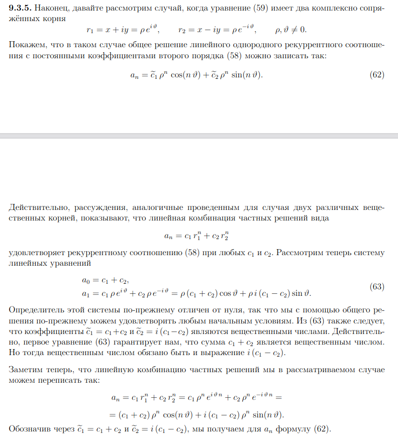

# Рекуррентные соотношения. Характеристические уравнения
## Рекуррентное соотношение
Пусть $a_0, a_1, a_2, ...$ произвольная числовая последовательность. Если для
любого $n > 0$ число $a_{n+m}$ является некоторой функцией от m предыдущих членов последовательности, т.е.
$$a_{n+m} = f_n(a_n, a_{n+1}, . . . , a_{n+m−1}),\qquad(1)$$
то такая последовательность называется **рекуррентной последовательностью**, а соотношение (1) **рекуррентным соотношением m-го порядка**. 

В частном случае линейной функции f имеем так называемое линейное рекуррентное соотношение
$$a_{n+m} = b_1(n)\ a_{n+m−1} + b_2(n)\ a_{n+m−2} + ... + b_{m−1}(n)\ a_{n+1} + b_m(n)\ a_n + u(n).\qquad(2)$$
В случае $u(n) = 0$ оно называется **однородным**, в противном случае - **неоднородным**.

Самый простой случай рекуррентного соотношения (2) - это _линейное однородное рекуррентное соотношение с постоянными коэффициентами_
$$a_{n+m} = b_1\ a_{n+m−1} + b_2\ a_{n+m−2} + ... + b_{m−1}\ a_{n+1} + b_m\ a_n.\qquad(3)$$

Для однозначного определения всех $a_n$ необходимо наряду с самим рекуррентным соотношением (1) задать и первые m членов $a_0, a_1, ... , a_{m−1}$ данной последовательности, то есть задать **начальные условия** для рекуррентного соотношения.

## Характеристическое уравнение
Будем рассматривать соотношение (3) 2-ого порядка:
$$a_{n+2} = b_1\ a_{n+1} + b_2\ a_{n}.\qquad(4)$$

Предположим, что частное решение уравнения (4) имеет вид $a_n = r^n$. Если подставить его в (4), то получим следующий многочлен
$$r^2 - b_1\ r - b_2 = 0 \qquad(5)$$
называемый **характеристическим** уравнением для (4). Любое его решение $r_0$ дает нам некоторое частное решение уравнения (4).    

Предположим, что характеристическое уравнение (5) имеет два различных вещественных корня $r_1$ и $r_2$.  В таком случае выражение
$$a_n = c_1\ r^n_1 + c_2\ r^n_2$$
где $c_1$ и $c_2$ - произвольные постоянные, является **общим решением** соотношения (4).  
Покажем вначале, что оно действительно удовлетворяет (4):  
$$c_1 r^{n+2}_1 + c_2 r^{n+2}_2 = b_1 c_1 r^{n+1}_1 + b_1 c_2 r^{n+1}_2 + b_2 c_1 r^n_1 + b_2 c_2 r^n_2 \Rightarrow\\
\Rightarrow c_1 r^n_1 (r^2_1 − b_1 r_1 − b_2) + c_2 r^n_2 (r_2^2 − b_1 r_2 − b_2) \equiv 0$$
Покажем теперь, что это действительно общее решение, т.е. что мы всегда можем подобрать константы c1 и c2 так, чтобы это решение удовлетворяло любым заданным начальным
условиям.  
Для этого рассмотрим это выражение при n = 0 и n = 1:
$$a_0 = c_1 r^0_1 + c_2 r^0_2 = c_1 + c_2$$
$$a_1 = c_1 r^1_1 + c_2 r^1_2 = c_1 r_1 + c_2 r_2$$
Определитель этой системы
$$\begin{vmatrix}
1 & 1 \\
r_1 & r_2 
\end{vmatrix} = r_2 - r_1 \ne 0$$
поэтому система всегда имеет единственное решение.

Предположим теперь, что характеристическое уравнение (5) имеет ровно один кратный корень $r_1 = r_2 = p$. Покажем, что в этом случае общее решение уравнения (4) имеет вид
$$a_n = c_1\ p^n + c_2\ n\ p^n$$

Мы уже показали, что частное решение вида $p_n$ удовлетворяет уравнению (4). Покажем, что этому уравнению удовлетворяет и частное решение вида $n p^n$:
$$(n + 2) p^{n+2} = b_1 (n + 1) p^{n+1} + b_2 n p^n \Rightarrow\\
\Rightarrow n (p^2 − b_1 p − b_2) + p (2 p − b_1) = 0$$

Первое слагаемое в левой части этого выражения равно нулю в силу характеристического уравнения. Для того, чтобы понять, что равно нулю и последнее слагаемое, заметим, что в случае совпадающих корней r1 = r2 = ρ имеем
$$p = \frac{b_1 ± 0}{2} \Rightarrow 2ρ − b_1 = 0$$

Осталось показать, что такой вид решения может удовлетворить любым начальным условиям.
Подставив начальные условия в выражение для $a_n$, получим следующую систему двух линейных алгебраических уравнений относительно параметров $c_1$ и $c_2$:
$$c_1 = a_0$$
$$p (c_1 + c_2) = a_1.$$
Понятно, что такая система имеет решение при любых $a_0$, $a_1$ и $p \ne 0$. Случай же $ρ = 0$ тривиален - в этом случае $b_1 = b_2 = 0$, и потому $a_n = 0$ для любых n.

