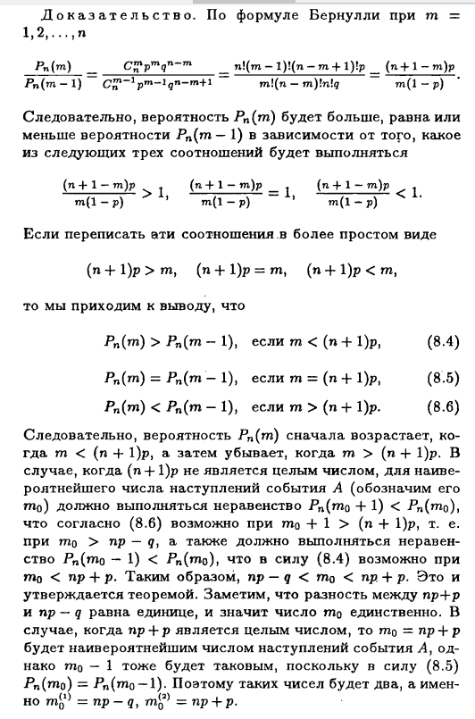

# Теория вероятности. Испытания Бернулли. Формула Бернулли. Наивероятнейшее число исходов

## Испытания Бернулли
Схема Бернулли описывает эксперименты со случайным исходом, заключающиеся в следующем. Проводятся n последовательных независимых одинаковых экспериментов (испытаний), в каждом из которых выделяется одно и тоже событие A, которое может наступить или не наступить в ходе эксперимента. Так как испытания одинаковы, то в любом из них событие А наступает с одинаковой вероятностью, обозначим ее p = Р(А). Вероятность дополнительного событияо бозначим q. Тогда q = Р($\overline{А}$) = 1 — р. Наступление события А обычно называют успехом, а ненаступление - неудачей.

## Формула Бернулли

 **Формула Бернулли**. Обозначим $Р_n(m) == Р(событие А наступило m раз в n испытаниях). Тогда
 $$P_n(m) = C_n^m p^m q^{n-m}$$

>Доказательство. Существует ровно $C_n^m$ различных возможностей выбрать m номеров испытаний, в которых наступает событие А. Таким образом, имеется $C_n^m$ несовместных событий типа $А_1А_2\overline{А_3}... A_k\overline{A_{k+i}}...А_n$, среди множителей которых m событий вида $Α_i$ и n — m событий вида $\overline{A_j}$. В сумме эти $C_n^m$ несовместных событий составляют событие {А наступило m раз в n испытаниях}. Каждое из слагаемых имеет вероятность
>$$P(А_1А_2\overline{А_3}... A_k\overline{A_{k+i}}...А_n)\\
= P(А_1)P(А_2)P(\overline{А_3})...Р(A_k)Р(\overline{A_{k+i}})...Ρ(Α_n) = p^m q^{n-m}$$
>Поскольку эти вероятности одинаковы, то суммарная вероятность имеет требуемый вид.

Пусть $m_i,m_2$ - целые числа, $0 \le m_1 \le m_2 \le n$. Обозначим через $P_n(m_1,m_2)$ вероятность того, что событие А наступило не менее $m_1$ и не более $m_2$ раз в n испытаниях. Тогда
$$P_n(m_1,m_2) = \sum_{k=m_1}^{m_2} C_n^k p^k q^{n-k}$$
или
$$P_n(m_1,m_2) = 1 - \sum_{k=0}^{m_1-1} C_n^k p^k q^{n-k} - \sum_{k=m_2+1}^{n} C_n^k p^k q^{n-k}$$

Число наступлений события А называется **наивероятнейшим**, если оно имеет наибольшую вероятность по сравнению с вероятностями наступления А любое другое количество раз.

Наивероятнейшее число наступлений события А в n испытаниях заключено между числами np - q и np + p.

Замечание. Если пр — q - целое число, то наивероятнейших чисел два: пр — q и пр + p.
> 
image.png